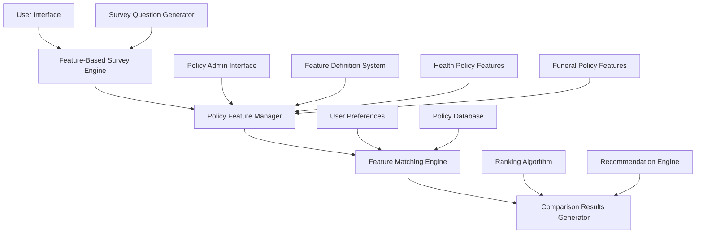

# Design Document

## Overview

The Policy System redesigns the policies, comparison, and survey applications around standardized insurance features for health and funeral policies. The system transforms from a generic policy comparison platform to a feature-driven matching system where policies are defined by standardized features from Docs/features.md, surveys collect user preferences for these features, and comparisons are made through intelligent feature matching.

This design leverages the existing Django architecture while introducing new feature-based models and workflows that provide more accurate, relevant policy recommendations.

## Architecture

### High-Level Architecture



### Component Interaction Flow

1. **Feature Definition**: Administrators define standardized features for health and funeral policies
2. **Policy Creation**: Policies are created by specifying values for required features
3. **Survey Generation**: Survey questions are automatically generated based on feature definitions
4. **User Survey**: Users complete insurance-type-specific surveys about their preferences
5. **Feature Matching**: System matches user preferences against policy features
6. **Ranking & Results**: Policies are ranked by compatibility and presented with explanations

## Components and Interfaces

### 1. Feature Definition System

#### PolicyFeatures Model (New)
```python
class PolicyFeatures(models.Model):
    """
    Core features model based on Docs/features.md for health and funeral policies.
    """
    
    class InsuranceType(models.TextChoices):
        HEALTH = 'HEALTH', 'Health Policies'
        FUNERAL = 'FUNERAL', 'Funeral Policies'
    
    policy = models.OneToOneField(BasePolicy, on_delete=models.CASCADE, related_name='policy_features')
    insurance_type = models.CharField(max_length=20, choices=InsuranceType.choices)
    
    # Health Policy Features (from Docs/features.md)
    annual_limit_per_member = models.DecimalField(
        max_digits=12, decimal_places=2, null=True, blank=True,
        help_text="Overall annual limit per member per family"
    )
    monthly_household_income = models.DecimalField(
        max_digits=10, decimal_places=2, null=True, blank=True,
        help_text="Monthly household income requirement"
    )
    in_hospital_benefit = models.BooleanField(
        null=True, blank=True,
        help_text="With or without in-hospital benefit"
    )
    out_hospital_benefit = models.BooleanField(
        null=True, blank=True,
        help_text="With or without out of hospital benefits"
    )
    chronic_medication_availability = models.BooleanField(
        null=True, blank=True,
        help_text="Chronic medication availability"
    )
    
    # Funeral Policy Features (from Docs/features.md)
    cover_amount = models.DecimalField(
        max_digits=12, decimal_places=2, null=True, blank=True,
        help_text="Cover amount for funeral policy"
    )
    marital_status_requirement = models.CharField(
        max_length=50, null=True, blank=True,
        help_text="Marital status requirement"
    )
    gender_requirement = models.CharField(
        max_length=20, null=True, blank=True,
        help_text="Gender requirement"
    )
    monthly_net_income = models.DecimalField(
        max_digits=10, decimal_places=2, null=True, blank=True,
        help_text="Monthly net income requirement"
    )
    
    created_at = models.DateTimeField(auto_now_add=True)
    updated_at = models.DateTimeField(auto_now=True)
    
    class Meta:
        verbose_name = "Policy Features"
        verbose_name_plural = "Policy Features"
    
    def __str__(self):
        return f"{self.policy.name} - {self.get_insurance_type_display()} Features"
```

#### AdditionalFeatures Model (Renamed from PolicyFeature)
```python
class AdditionalFeatures(models.Model):
    """
    Additional features and benefits for policies (renamed from PolicyFeature).
    """
    policy = models.ForeignKey(
        BasePolicy,
        on_delete=models.CASCADE,
        related_name='additional_features'
    )
    
    title = models.CharField(
        max_length=255,
        help_text="Additional feature title"
    )
    
    description = models.TextField(
        help_text="Detailed additional feature description"
    )
    
    icon = models.CharField(
        max_length=50,
        blank=True,
        help_text="Icon name or CSS class"
    )
    
    is_highlighted = models.BooleanField(
        default=False,
        help_text="Whether to highlight this additional feature"
    )
    
    display_order = models.PositiveIntegerField(
        default=0,
        help_text="Order in which to display additional features"
    )
    
    created_at = models.DateTimeField(auto_now_add=True)
    
    class Meta:
        ordering = ['policy', 'display_order', 'title']
        verbose_name = "Additional Features"
        verbose_name_plural = "Additional Features"
        indexes = [
            models.Index(fields=['policy', 'is_highlighted']),
        ]
    
    def __str__(self):
        return f"{self.title} - {self.policy.name}"
```

### 2. Enhanced Policy Models

#### Enhanced BasePolicy Model
The existing BasePolicy model will be extended with feature-based methods:

```python
# Additional methods for BasePolicy
def get_policy_features(self):
    """Get the PolicyFeatures instance for this policy."""
    try:
        return self.policy_features
    except PolicyFeatures.DoesNotExist:
        return None

def get_feature_value(self, feature_name):
    """Get the value of a specific feature."""
    policy_features = self.get_policy_features()
    if policy_features:
        return getattr(policy_features, feature_name, None)
    return None

def get_all_features_dict(self):
    """Get all feature values as a dictionary."""
    policy_features = self.get_policy_features()
    if not policy_features:
        return {}
    
    features = {}
    if policy_features.insurance_type == 'HEALTH':
        features.update({
            'annual_limit_per_member': policy_features.annual_limit_per_member,
            'monthly_household_income': policy_features.monthly_household_income,
            'in_hospital_benefit': policy_features.in_hospital_benefit,
            'out_hospital_benefit': policy_features.out_hospital_benefit,
            'chronic_medication_availability': policy_features.chronic_medication_availability,
        })
    elif policy_features.insurance_type == 'FUNERAL':
        features.update({
            'cover_amount': policy_features.cover_amount,
            'marital_status_requirement': policy_features.marital_status_requirement,
            'gender_requirement': policy_features.gender_requirement,
            'monthly_net_income': policy_features.monthly_net_income,
        })
    
    return {k: v for k, v in features.items() if v is not None}

def calculate_feature_compatibility(self, user_preferences):
    """Calculate compatibility score based on user preferences."""
    # Implementation in FeatureMatchingEngine
    pass
```

### 3. Simplified Survey System

#### Survey Models
```python
class SimpleSurvey(models.Model):
    """
    Simplified survey focusing only on policy features and contact info.
    """
    
    class InsuranceType(models.TextChoices):
        HEALTH = 'HEALTH', 'Health Policies'
        FUNERAL = 'FUNERAL', 'Funeral Policies'
    
    # Contact Information (for survey only)
    first_name = models.CharField(max_length=100)
    last_name = models.CharField(max_length=100)
    date_of_birth = models.DateField()
    email = models.EmailField(blank=True)
    phone = models.CharField(max_length=20, blank=True)
    
    # Insurance type selection
    insurance_type = models.CharField(max_length=20, choices=InsuranceType.choices)
    
    # Health Policy Preferences
    preferred_annual_limit = models.DecimalField(
        max_digits=12, decimal_places=2, null=True, blank=True,
        help_text="Preferred annual limit per member per family"
    )
    household_income = models.DecimalField(
        max_digits=10, decimal_places=2, null=True, blank=True,
        help_text="Monthly household income"
    )
    wants_in_hospital_benefit = models.BooleanField(
        null=True, blank=True,
        help_text="Do you want in-hospital benefits?"
    )
    wants_out_hospital_benefit = models.BooleanField(
        null=True, blank=True,
        help_text="Do you want out-of-hospital benefits?"
    )
    needs_chronic_medication = models.BooleanField(
        null=True, blank=True,
        help_text="Do you need chronic medication coverage?"
    )
    
    # Funeral Policy Preferences
    preferred_cover_amount = models.DecimalField(
        max_digits=12, decimal_places=2, null=True, blank=True,
        help_text="Preferred cover amount"
    )
    marital_status = models.CharField(
        max_length=50, null=True, blank=True,
        help_text="Marital status"
    )
    gender = models.CharField(
        max_length=20, null=True, blank=True,
        help_text="Gender"
    )
    net_income = models.DecimalField(
        max_digits=10, decimal_places=2, null=True, blank=True,
        help_text="Monthly net income"
    )
    
    # Metadata
    created_at = models.DateTimeField(auto_now_add=True)
    updated_at = models.DateTimeField(auto_now=True)
    
    class Meta:
        verbose_name = "Simple Survey"
        verbose_name_plural = "Simple Surveys"
    
    def __str__(self):
        return f"{self.first_name} {self.last_name} - {self.get_insurance_type_display()}"
    
    def get_preferences_dict(self):
        """Get user preferences as dictionary for matching."""
        if self.insurance_type == 'HEALTH':
            return {
                'annual_limit_per_member': self.preferred_annual_limit,
                'monthly_household_income': self.household_income,
                'in_hospital_benefit': self.wants_in_hospital_benefit,
                'out_hospital_benefit': self.wants_out_hospital_benefit,
                'chronic_medication_availability': self.needs_chronic_medication,
            }
        elif self.insurance_type == 'FUNERAL':
            return {
                'cover_amount': self.preferred_cover_amount,
                'marital_status_requirement': self.marital_status,
                'gender_requirement': self.gender,
                'monthly_net_income': self.net_income,
            }
        return {}
```

### 4. Feature Matching Engine

#### Core Matching Algorithm
```python
class FeatureMatchingEngine:
    """
    Matches user preferences against policy features.
    """
    
    def __init__(self, insurance_type):
        self.insurance_type = insurance_type
    
    def calculate_policy_compatibility(self, policy, user_preferences):
        """
        Calculate compatibility score between policy and user preferences.
        
        Returns:
            dict: {
                'overall_score': float,
                'feature_scores': dict,
                'matches': list,
                'mismatches': list,
                'explanation': str
            }
        """
        policy_features = policy.get_policy_features()
        if not policy_features or policy_features.insurance_type != self.insurance_type:
            return self._empty_result()
        
        feature_scores = {}
        matches = []
        mismatches = []
        
        for feature_name, user_pref in user_preferences.items():
            if user_pref is None:
                continue
                
            policy_value = getattr(policy_features, feature_name, None)
            if policy_value is None:
                continue
            
            score = self._calculate_feature_score(feature_name, policy_value, user_pref)
            feature_scores[feature_name] = score
            
            if score >= 0.8:  # High match threshold
                matches.append({
                    'feature': feature_name.replace('_', ' ').title(),
                    'user_preference': user_pref,
                    'policy_value': policy_value,
                    'score': score
                })
            elif score < 0.5:  # Low match threshold
                mismatches.append({
                    'feature': feature_name.replace('_', ' ').title(),
                    'user_preference': user_pref,
                    'policy_value': policy_value,
                    'score': score
                })
        
        # Calculate overall score
        overall_score = sum(feature_scores.values()) / len(feature_scores) if feature_scores else 0
        
        return {
            'overall_score': overall_score,
            'feature_scores': feature_scores,
            'matches': matches,
            'mismatches': mismatches,
            'explanation': self._generate_explanation(matches, mismatches, overall_score)
        }
    
    def _calculate_feature_score(self, feature_name, policy_value, user_preference):
        """Calculate score for individual feature match."""
        if isinstance(policy_value, bool) and isinstance(user_preference, bool):
            return 1.0 if policy_value == user_preference else 0.0
        
        elif isinstance(policy_value, (int, float, Decimal)) and isinstance(user_preference, (int, float, Decimal)):
            # For numeric values, check if policy meets or exceeds user preference
            if policy_value >= user_preference:
                return 1.0
            else:
                # Partial score based on how close it is
                return max(0.0, policy_value / user_preference)
        
        elif isinstance(policy_value, str) and isinstance(user_preference, str):
            return 1.0 if policy_value.lower() == user_preference.lower() else 0.0
        
        return 0.5  # Default neutral score for unhandled types
    
    def _empty_result(self):
        """Return empty result for incompatible policies."""
        return {
            'overall_score': 0.0,
            'feature_scores': {},
            'matches': [],
            'mismatches': [],
            'explanation': 'Policy type does not match survey type'
        }
    
    def _generate_explanation(self, matches, mismatches, overall_score):
        """Generate human-readable explanation of the match."""
        if overall_score >= 0.8:
            return f"Excellent match with {len(matches)} matching features"
        elif overall_score >= 0.6:
            return f"Good match with {len(matches)} matching features and {len(mismatches)} areas for consideration"
        elif overall_score >= 0.4:
            return f"Partial match with {len(matches)} matching features but {len(mismatches)} mismatches"
        else:
            return f"Poor match with only {len(matches)} matching features"
```

### 5. Enhanced Comparison System

#### Feature-Based Comparison Results
```python
class FeatureComparisonResult(models.Model):
    """
    Enhanced comparison results with feature-specific scoring.
    """
    survey = models.ForeignKey(SimpleSurvey, on_delete=models.CASCADE)
    policy = models.ForeignKey(BasePolicy, on_delete=models.CASCADE)
    
    # Overall scoring
    overall_compatibility_score = models.DecimalField(max_digits=5, decimal_places=2)
    feature_match_count = models.PositiveIntegerField()
    feature_mismatch_count = models.PositiveIntegerField()
    
    # Detailed feature analysis
    feature_scores = models.JSONField(default=dict)
    feature_matches = models.JSONField(default=list)
    feature_mismatches = models.JSONField(default=list)
    
    # Ranking and recommendations
    compatibility_rank = models.PositiveIntegerField()
    recommendation_category = models.CharField(
        max_length=50,
        choices=[
            ('PERFECT_MATCH', 'Perfect Match'),
            ('EXCELLENT_MATCH', 'Excellent Match'),
            ('GOOD_MATCH', 'Good Match'),
            ('PARTIAL_MATCH', 'Partial Match'),
            ('POOR_MATCH', 'Poor Match'),
        ]
    )
    
    # Explanations
    match_explanation = models.TextField()
    
    created_at = models.DateTimeField(auto_now_add=True)
    
    class Meta:
        ordering = ['-overall_compatibility_score']
        unique_together = ['survey', 'policy']
```

### 6. User Interface Components

#### Feature-Based Policy Cards
```html
<!-- Policy card template with feature highlights -->
<div class="policy-card" data-compatibility-score="{{ result.overall_compatibility_score }}">
    <div class="policy-header">
        <h3>{{ policy.name }}</h3>
        <div class="compatibility-badge">
            {{ result.overall_compatibility_score|floatformat:0 }}% Match
        </div>
    </div>
    
    <div class="feature-highlights">
        
        <div class="feature-match">
            <i class="icon-check"></i>
            <span>{{ match.feature }}: {{ match.policy_value }}</span>
        </div>
        
    </div>
    
    <div class="feature-concerns">
        
        <div class="feature-mismatch">
            <i class="icon-warning"></i>
            <span>{{ mismatch.feature }}: {{ mismatch.policy_value }}</span>
        </div>
        
    </div>
</div>
```

#### Feature Comparison Matrix
```html
<!-- Side-by-side feature comparison -->
<table class="feature-comparison-table">
    <thead>
        <tr>
            <th>Feature</th>
            <th>Your Preference</th>
            
            <th>{{ policy.name }}</th>
            
        </tr>
    </thead>
    <tbody>
        
        <tr>
            <td>{{ feature_name }}</td>
            <td class="user-preference">
                {{ user_preferences|get_item:feature_code }}
            </td>
            
            <td class="policy-value matchmismatch">
                {{ policy|get_feature_value:feature_code }}
            </td>
            
        </tr>
        
    </tbody>
</table>
```

## Data Models

### Core Feature Models

```python
class PolicyFeatures(models.Model):
    # As defined above - core features from Docs/features.md
    pass

class AdditionalFeatures(models.Model):
    # As defined above - renamed from PolicyFeature
    pass

class SimpleSurvey(models.Model):
    # As defined above - simplified survey with contact info and features
    pass

class FeatureComparisonResult(models.Model):
    # As defined above - comparison results
    pass
```

## Error Handling

### Feature Validation
1. **Missing Features**: Handle policies with incomplete feature definitions
2. **Invalid Values**: Validate feature values against expected types
3. **Type Mismatches**: Ensure survey responses match expected feature types
4. **Compatibility Calculation**: Graceful handling of calculation errors

### Survey Integration
1. **Incomplete Surveys**: Provide partial matching for incomplete responses
2. **Data Validation**: Validate contact information and feature preferences

## Testing Strategy

### Unit Testing
1. **PolicyFeatures Model Tests**: Feature value storage, retrieval, validation
2. **Matching Algorithm Tests**: Score calculation, ranking accuracy
3. **SimpleSurvey Tests**: Survey creation, preference extraction
4. **Comparison Tests**: Result generation and ranking

### Integration Testing
1. **End-to-End Feature Flow**: Survey → matching → results
2. **Cross-Insurance Type Testing**: Ensure health and funeral features work independently
3. **Data Consistency**: Verify data integrity across models