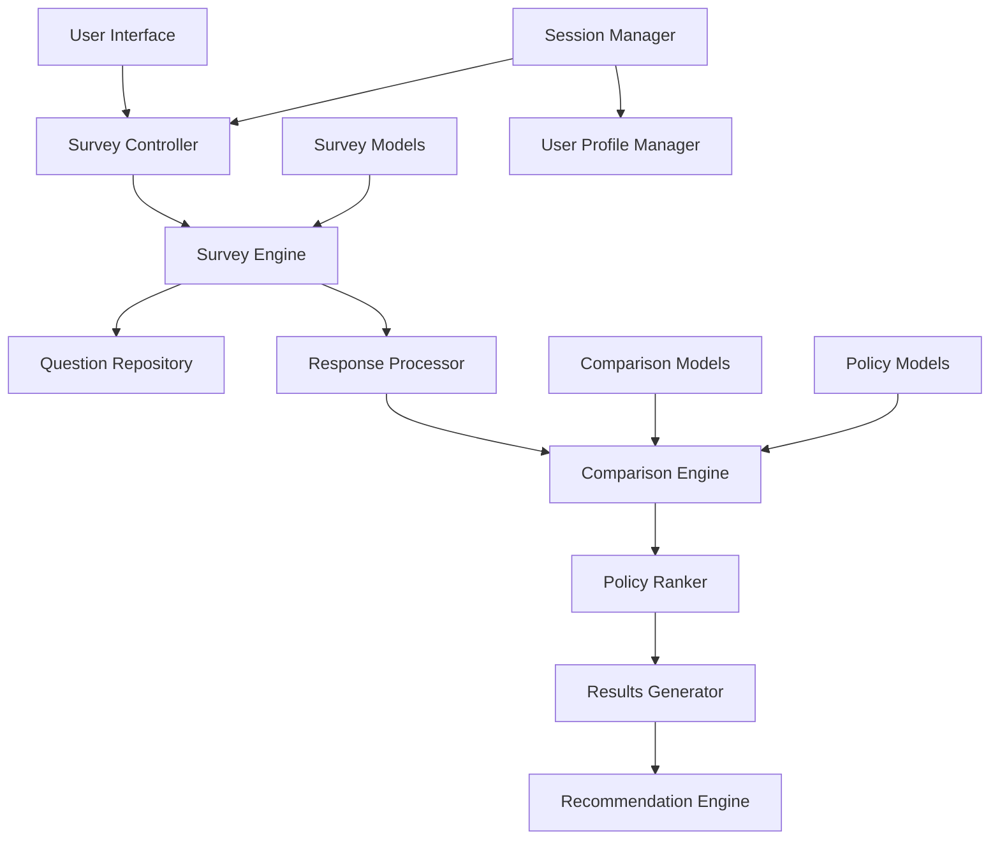

# Design Document

## Overview

The Policy Comparison Surveys feature extends the existing comparison engine to provide personalized insurance recommendations through category-specific surveys. Users complete detailed questionnaires about their insurance needs, and the system uses these responses to intelligently weight comparison criteria and generate tailored policy rankings.

The design leverages the existing `PolicyComparisonEngine` and `ComparisonSession` models while adding new survey-specific models and workflows. The system supports both anonymous and authenticated users, with progressive enhancement for registered users who can save and reuse their survey responses.

## Architecture

### High-Level Architecture



### Component Interaction Flow

1. **Survey Initiation**: User selects insurance category and starts survey
2. **Question Delivery**: System presents category-specific questions in logical groups
3. **Response Collection**: User responses are validated and stored progressively
4. **Criteria Mapping**: Survey responses are mapped to comparison engine criteria
5. **Policy Filtering**: System identifies relevant policies for comparison
6. **Intelligent Scoring**: Comparison engine scores policies using weighted criteria
7. **Result Generation**: Ranked results with personalized explanations are created
8. **Recommendation Delivery**: User receives tailored recommendations with actionable insights

## Components and Interfaces

### 1. Survey Management System

#### SurveyQuestion Model
```python
class SurveyQuestion(models.Model):
    category = ForeignKey(PolicyCategory)
    section = CharField()  # e.g., "Personal Info", "Coverage Needs"
    question_text = TextField()
    question_type = CharField()  # TEXT, NUMBER, CHOICE, MULTI_CHOICE, RANGE, BOOLEAN
    field_name = CharField()  # Maps to comparison criteria
    choices = JSONField()  # For choice-based questions
    validation_rules = JSONField()  # Min/max values, required, etc.
    weight_impact = DecimalField()  # How much this affects comparison weighting
    help_text = TextField()
    is_required = BooleanField()
    display_order = PositiveIntegerField()
```

#### SurveyResponse Model
```python
class SurveyResponse(models.Model):
    session = ForeignKey(ComparisonSession)
    question = ForeignKey(SurveyQuestion)
    response_value = JSONField()  # Flexible storage for different response types
    confidence_level = IntegerField()  # User's confidence in their answer (1-5)
    created_at = DateTimeField()
    updated_at = DateTimeField()
```

#### SurveyTemplate Model
```python
class SurveyTemplate(models.Model):
    category = ForeignKey(PolicyCategory)
    name = CharField()
    description = TextField()
    version = CharField()
    is_active = BooleanField()
    questions = ManyToManyField(SurveyQuestion, through='TemplateQuestion')
```

### 2. Survey Engine

#### Core Survey Engine Class
```python
class SurveyEngine:
    def __init__(self, category_slug: str):
        self.category_slug = category_slug
        self.template = self._load_template()
    
    def get_survey_sections(self) -> List[Dict]:
        """Return organized survey sections with questions"""
    
    def validate_response(self, question_id: int, response: Any) -> Dict:
        """Validate user response against question rules"""
    
    def save_response(self, session: ComparisonSession, question_id: int, response: Any):
        """Save validated response to database"""
    
    def calculate_completion_percentage(self, session: ComparisonSession) -> float:
        """Calculate survey completion percentage"""
    
    def generate_comparison_criteria(self, session: ComparisonSession) -> Dict:
        """Convert survey responses to comparison engine criteria"""
```

### 3. Category-Specific Survey Configurations

#### Health Insurance Survey Sections
1. **Personal Information**
   - Age, gender, location
   - Family size and dependents
   - Employment status

2. **Health Status & History**
   - Current health conditions
   - Chronic medications
   - Recent medical procedures
   - Family medical history

3. **Coverage Preferences**
   - Hospital vs day-to-day cover priority
   - Preferred hospital networks
   - Dental and optical needs
   - Alternative medicine preferences

4. **Financial Considerations**
   - Budget range for premiums
   - Preferred deductible levels
   - Co-payment tolerance
   - Savings account integration

#### Funeral Insurance Survey Sections
1. **Family Structure**
   - Number of family members to cover
   - Ages of dependents
   - Extended family considerations

2. **Service Preferences**
   - Burial vs cremation preference
   - Service location preferences
   - Cultural/religious requirements
   - Repatriation needs

3. **Coverage Requirements**
   - Desired coverage amounts
   - Additional benefits priority
   - Waiting period tolerance
   - Claim payout speed importance

4. **Budget & Payment**
   - Monthly premium budget
   - Payment frequency preference
   - Inflation protection needs

### 4. Response Processing & Criteria Mapping

#### ResponseProcessor Class
```python
class ResponseProcessor:
    def __init__(self, category_slug: str):
        self.category_slug = category_slug
        self.mapping_rules = self._load_mapping_rules()
    
    def process_responses(self, session: ComparisonSession) -> Dict:
        """Process all responses and generate comparison criteria"""
    
    def calculate_weights(self, responses: List[SurveyResponse]) -> Dict:
        """Calculate dynamic weights based on user priorities"""
    
    def generate_filters(self, responses: List[SurveyResponse]) -> Dict:
        """Generate policy filters based on hard requirements"""
    
    def create_user_profile(self, responses: List[SurveyResponse]) -> Dict:
        """Create user profile for personalized explanations"""
```

### 5. Enhanced Comparison Integration

#### Extended PolicyComparisonEngine
The existing comparison engine will be enhanced to:

1. **Accept Survey-Driven Criteria**: Process criteria generated from survey responses
2. **Dynamic Weight Adjustment**: Adjust scoring weights based on user priorities
3. **Personalized Explanations**: Generate explanations that reference user's survey responses
4. **Confidence Scoring**: Factor in user's confidence levels when scoring policies

#### Survey-Aware Scoring
```python
def _score_policy_with_survey_context(
    self,
    policy: BasePolicy,
    survey_criteria: Dict,
    user_profile: Dict
) -> Dict:
    """Enhanced scoring that considers survey context"""
    
    # Standard scoring
    base_score = self._score_policy(policy, survey_criteria)
    
    # Survey-specific adjustments
    confidence_adjustment = self._apply_confidence_weighting(base_score, user_profile)
    priority_boost = self._apply_priority_boosting(base_score, user_profile)
    
    return {
        **base_score,
        'survey_adjusted_score': confidence_adjustment + priority_boost,
        'personalization_factors': self._get_personalization_factors(policy, user_profile)
    }
```

### 6. User Interface Components

#### Survey Flow Components
1. **Category Selection**: Insurance type chooser with descriptions
2. **Progress Tracker**: Visual progress indicator with section completion
3. **Question Renderer**: Dynamic question display based on question type
4. **Response Validator**: Real-time validation with helpful error messages
5. **Section Navigator**: Allow users to move between completed sections
6. **Save & Resume**: Automatic progress saving with manual save option

#### Results Display Components
1. **Personalized Dashboard**: Show how survey responses influenced rankings
2. **Policy Cards**: Enhanced policy display with survey-specific highlights
3. **Comparison Matrix**: Side-by-side comparison with survey criteria emphasis
4. **Explanation Panel**: Detailed explanations referencing user's responses
5. **Recommendation Carousel**: Categorized recommendations (best match, best value, etc.)

## Data Models

### Extended ComparisonSession
```python
# Add to existing ComparisonSession model
survey_completed = BooleanField(default=False)
survey_completion_percentage = DecimalField(max_digits=5, decimal_places=2, default=0)
survey_responses_count = PositiveIntegerField(default=0)
user_profile = JSONField(default=dict)  # Processed user profile from responses
```

### Question-Response Relationship
```python
class QuestionDependency(models.Model):
    """Define conditional question logic"""
    parent_question = ForeignKey(SurveyQuestion, related_name='child_dependencies')
    child_question = ForeignKey(SurveyQuestion, related_name='parent_dependencies')
    condition_value = JSONField()  # Value that triggers child question
    condition_operator = CharField()  # EQUALS, GREATER_THAN, CONTAINS, etc.
```

### Survey Analytics
```python
class SurveyAnalytics(models.Model):
    """Track survey performance and user behavior"""
    question = ForeignKey(SurveyQuestion)
    total_responses = PositiveIntegerField(default=0)
    completion_rate = DecimalField(max_digits=5, decimal_places=2)
    average_response_time = DurationField()
    skip_rate = DecimalField(max_digits=5, decimal_places=2)
    last_updated = DateTimeField(auto_now=True)
```

## Error Handling

### Survey-Specific Error Handling
1. **Validation Errors**: Clear, contextual error messages for invalid responses
2. **Session Expiry**: Graceful handling of expired sessions with recovery options
3. **Incomplete Surveys**: Allow partial completion with clear indicators
4. **Data Consistency**: Ensure survey responses remain consistent with comparison results
5. **Fallback Mechanisms**: Default comparison behavior when survey data is incomplete

### Error Recovery Strategies
1. **Auto-Save**: Automatic saving of responses every 30 seconds
2. **Session Recovery**: Restore incomplete surveys from browser storage
3. **Graceful Degradation**: Fall back to basic comparison when survey fails
4. **User Notification**: Clear communication about data loss risks

## Testing Strategy

### Unit Testing
1. **Survey Engine Tests**: Question loading, response validation, criteria generation
2. **Response Processor Tests**: Mapping logic, weight calculation, filter generation
3. **Model Tests**: Data integrity, relationships, validation rules
4. **Comparison Integration Tests**: Survey criteria processing, scoring adjustments

### Integration Testing
1. **End-to-End Survey Flow**: Complete survey submission and result generation
2. **Cross-Category Testing**: Multiple insurance types with different survey structures
3. **User Session Management**: Anonymous and authenticated user workflows
4. **Performance Testing**: Large survey responses and complex comparison scenarios

### User Acceptance Testing
1. **Survey Usability**: Question clarity, flow logic, completion rates
2. **Result Accuracy**: Verify recommendations match user expectations
3. **Mobile Responsiveness**: Survey completion on various devices
4. **Accessibility**: Screen reader compatibility, keyboard navigation

## Performance Considerations

### Optimization Strategies
1. **Lazy Loading**: Load questions progressively as user advances
2. **Response Caching**: Cache processed criteria to avoid recomputation
3. **Database Indexing**: Optimize queries for survey responses and comparisons
4. **Background Processing**: Process complex comparisons asynchronously
5. **CDN Integration**: Cache static survey assets and question templates

### Scalability Planning
1. **Horizontal Scaling**: Design for multiple survey engine instances
2. **Database Partitioning**: Partition survey responses by category and date
3. **Caching Strategy**: Multi-level caching for questions, responses, and results
4. **Queue Management**: Handle comparison processing through job queues

## Security & Privacy

### Data Protection
1. **Response Encryption**: Encrypt sensitive survey responses at rest
2. **Session Security**: Secure session management for anonymous users
3. **Data Retention**: Configurable retention policies for survey data
4. **User Consent**: Clear consent mechanisms for data collection and processing

### Privacy Considerations
1. **Anonymous Surveys**: Full functionality without user registration
2. **Data Minimization**: Collect only necessary information for comparisons
3. **User Control**: Allow users to delete their survey data
4. **Transparency**: Clear explanation of how survey data influences results

## Migration & Deployment

### Database Migrations
1. **Survey Models**: Create new survey-related tables
2. **Comparison Extensions**: Extend existing comparison models
3. **Data Seeding**: Populate initial survey questions and templates
4. **Index Creation**: Add performance indexes for new query patterns

### Feature Rollout
1. **Phased Deployment**: Start with one insurance category
2. **A/B Testing**: Compare survey-driven vs traditional comparison results
3. **User Feedback Integration**: Collect and incorporate user feedback
4. **Performance Monitoring**: Monitor system performance under survey load

### Backward Compatibility
1. **Existing Comparisons**: Maintain support for non-survey comparisons
2. **API Versioning**: Version APIs to support both survey and traditional flows
3. **Data Migration**: Migrate existing comparison sessions to new structure
4. **Feature Flags**: Use feature flags to control survey availability