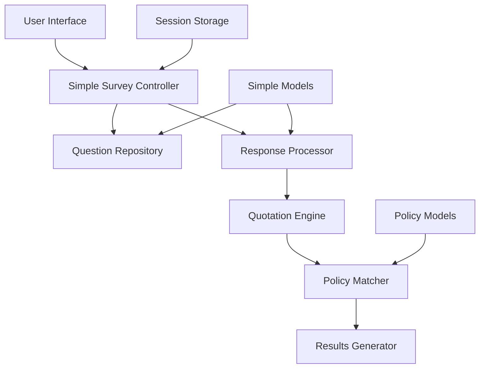

# Design Document

## Overview

The Simplified Survey System redesigns the existing complex survey questionnaire into a streamlined, high-performance Django application focused on essential functionality. The system eliminates unnecessary complexity while maintaining the core capability to collect user information and generate personalized insurance quotations for health and funeral policies.

The design prioritizes simplicity, performance, and maintainability by removing advanced features like A/B testing, analytics, conditional questions, templates, and complex caching in favor of a direct, efficient approach that serves the primary business need: converting user responses into relevant policy quotations quickly.

## Architecture

### High-Level Architecture



### Simplified Component Flow

1. **Survey Selection**: User chooses health or funeral insurance
2. **Question Delivery**: System presents 6-10 essential questions
3. **Response Collection**: User responses validated and stored immediately
4. **Quotation Generation**: Responses processed to generate policy matches
5. **Results Display**: Top 5 matching policies displayed with clear comparison

## Components and Interfaces

### 1. Simplified Survey Models

#### SimpleSurveyQuestion Model
```python
class SimpleSurveyQuestion(models.Model):
    category = models.CharField(max_length=20, choices=[('health', 'Health'), ('funeral', 'Funeral')])
    question_text = models.TextField()
    field_name = models.CharField(max_length=50)  # Maps to quotation criteria
    input_type = models.CharField(max_length=20, choices=[
        ('text', 'Text'), ('number', 'Number'), ('select', 'Dropdown'), 
        ('radio', 'Radio Buttons'), ('checkbox', 'Checkboxes')
    ])
    choices = models.JSONField(default=list, blank=True)  # For select/radio/checkbox
    is_required = models.BooleanField(default=True)
    display_order = models.PositiveIntegerField()
    validation_rules = models.JSONField(default=dict, blank=True)  # Simple validation only
```

#### SimpleSurveyResponse Model
```python
class SimpleSurveyResponse(models.Model):
    session_key = models.CharField(max_length=100)
    category = models.CharField(max_length=20)
    question = models.ForeignKey(SimpleSurveyQuestion, on_delete=models.CASCADE)
    response_value = models.JSONField()
    created_at = models.DateTimeField(auto_now_add=True)
```

#### QuotationSession Model
```python
class QuotationSession(models.Model):
    session_key = models.CharField(max_length=100, unique=True)
    category = models.CharField(max_length=20)
    user_criteria = models.JSONField(default=dict)  # Processed from responses
    is_completed = models.BooleanField(default=False)
    created_at = models.DateTimeField(auto_now_add=True)
    expires_at = models.DateTimeField()  # 24 hour expiry
```

### 2. Predefined Question Sets

#### Health Insurance Questions (8 questions)
1. **Age**: Number input (18-80)
2. **Location**: Dropdown (provinces)
3. **Family Size**: Number input (1-10)
4. **Current Health Status**: Radio (Excellent/Good/Fair/Poor)
5. **Chronic Conditions**: Checkbox (Diabetes/Hypertension/Heart Disease/None)
6. **Coverage Priority**: Radio (Hospital/Day-to-day/Comprehensive)
7. **Monthly Budget**: Number input (R200-R5000)
8. **Preferred Deductible**: Radio (None/R1000/R2500/R5000)

#### Funeral Insurance Questions (7 questions)
1. **Age**: Number input (18-80)
2. **Location**: Dropdown (provinces)
3. **Family Members to Cover**: Number input (1-15)
4. **Coverage Amount Needed**: Radio (R25k/R50k/R100k/R200k+)
5. **Service Preference**: Radio (Basic/Standard/Premium)
6. **Monthly Budget**: Number input (R50-R500)
7. **Waiting Period Tolerance**: Radio (None/3 months/6 months/12 months)

### 3. Simple Survey Engine

#### Core Survey Engine Class
```python
class SimpleSurveyEngine:
    def __init__(self, category: str):
        self.category = category
        self.questions = self._load_questions()
    
    def get_questions(self) -> List[Dict]:
        """Return all questions for the category in order"""
        return [self._serialize_question(q) for q in self.questions]
    
    def validate_response(self, question_id: int, response: Any) -> Dict:
        """Simple validation based on input type and rules"""
        question = self._get_question(question_id)
        return self._validate_by_type(question, response)
    
    def save_response(self, session_key: str, question_id: int, response: Any) -> bool:
        """Save response immediately to database"""
        if self.validate_response(question_id, response)['is_valid']:
            SimpleSurveyResponse.objects.update_or_create(
                session_key=session_key,
                question_id=question_id,
                defaults={'response_value': response}
            )
            return True
        return False
    
    def process_responses(self, session_key: str) -> Dict:
        """Convert responses to quotation criteria"""
        responses = SimpleSurveyResponse.objects.filter(session_key=session_key)
        return self._responses_to_criteria(responses)
```

### 4. Quotation Engine Integration

#### Simple Quotation Processor
```python
class SimpleQuotationProcessor:
    def __init__(self, category: str):
        self.category = category
    
    def generate_quotations(self, user_criteria: Dict) -> List[Dict]:
        """Generate top 5 policy quotations based on criteria"""
        # Get eligible policies
        policies = self._get_eligible_policies(user_criteria)
        
        # Score and rank policies
        scored_policies = []
        for policy in policies:
            score = self._calculate_simple_score(policy, user_criteria)
            scored_policies.append({
                'policy': policy,
                'score': score,
                'monthly_premium': self._calculate_premium(policy, user_criteria),
                'match_reasons': self._get_match_reasons(policy, user_criteria)
            })
        
        # Return top 5
        return sorted(scored_policies, key=lambda x: x['score'], reverse=True)[:5]
    
    def _calculate_simple_score(self, policy: BasePolicy, criteria: Dict) -> float:
        """Simple scoring algorithm focusing on key factors"""
        score = 0.0
        
        # Budget match (40% weight)
        budget_score = self._score_budget_match(policy, criteria.get('monthly_budget', 0))
        score += budget_score * 0.4
        
        # Coverage match (30% weight)
        coverage_score = self._score_coverage_match(policy, criteria)
        score += coverage_score * 0.3
        
        # Feature match (20% weight)
        feature_score = self._score_feature_match(policy, criteria)
        score += feature_score * 0.2
        
        # Organization reputation (10% weight)
        org_score = self._score_organization(policy.organization)
        score += org_score * 0.1
        
        return min(100.0, max(0.0, score))
```

### 5. User Interface Components

#### Single Page Survey Form
- Progressive form with all questions visible
- Real-time validation feedback
- Simple progress bar
- Auto-save on each response
- Mobile-responsive design

#### Results Display
- Clean comparison table
- Key metrics highlighted (premium, coverage, features)
- Simple "Get Quote" buttons
- No complex filtering or sorting

### 6. Data Flow Optimization

#### Database Design for Performance
```sql
-- Indexes for fast queries
CREATE INDEX idx_survey_response_session ON simple_survey_response(session_key);
CREATE INDEX idx_survey_response_category ON simple_survey_response(category);
CREATE INDEX idx_quotation_session_key ON quotation_session(session_key);
CREATE INDEX idx_policy_category_active ON policies_basepolicy(category_id, is_active);
```

#### Caching Strategy
- Cache question sets (rarely change)
- Cache policy data for quotations (refresh hourly)
- No user session caching (keep it simple)

## Error Handling

### Simplified Error Handling
1. **Validation Errors**: Immediate inline feedback
2. **Session Expiry**: Redirect to start new survey
3. **No Policies Found**: Show message with contact information
4. **System Errors**: Generic error page with retry option

### Graceful Degradation
- If quotation engine fails, show basic policy list
- If validation fails, allow submission with warnings
- If database is slow, show loading indicator

## Testing Strategy

### Unit Testing
1. **Question Loading**: Test question retrieval and serialization
2. **Response Validation**: Test all input types and validation rules
3. **Quotation Generation**: Test scoring algorithm and policy matching
4. **Session Management**: Test session creation and expiry

### Integration Testing
1. **End-to-End Survey Flow**: Complete survey to quotation generation
2. **Mobile Responsiveness**: Test on various screen sizes
3. **Performance Testing**: Test with 100 concurrent users
4. **Database Performance**: Test query performance under load

## Performance Considerations

### Optimization Strategies
1. **Minimal Database Queries**: Use select_related and prefetch_related
2. **Simple Scoring Algorithm**: Avoid complex calculations
3. **Limited Policy Set**: Show only top 5 results
4. **No Real-time Updates**: Static content with periodic refresh
5. **Efficient Indexing**: Index all frequently queried fields

### Performance Targets
- Page load time: < 2 seconds
- Survey completion: < 3 seconds
- Quotation generation: < 3 seconds
- Support 100 concurrent users
- 99% uptime

## Security & Privacy

### Data Protection
1. **Session-based Storage**: No permanent user data storage
2. **24-hour Expiry**: Automatic data cleanup
3. **No Personal Information**: Collect only essential criteria
4. **HTTPS Only**: Secure data transmission

### Privacy Considerations
1. **Anonymous Usage**: No user accounts required
2. **Minimal Data Collection**: Only insurance-relevant information
3. **No Tracking**: No analytics or user behavior tracking
4. **Clear Data Policy**: Simple privacy notice

## Migration Strategy

### From Complex to Simple System
1. **Parallel Deployment**: Run both systems temporarily
2. **Data Migration**: Extract essential questions from existing system
3. **URL Redirects**: Redirect old survey URLs to new system
4. **Feature Flag**: Toggle between systems during transition

### Database Changes
1. **New Simple Tables**: Create simplified survey models
2. **Data Seeding**: Populate with essential questions
3. **Index Creation**: Add performance indexes
4. **Cleanup**: Remove unused complex models after migration

## Deployment Architecture

### Simple Deployment Stack
- **Web Server**: Nginx for static files and load balancing
- **Application Server**: Gunicorn with Django
- **Database**: PostgreSQL with connection pooling
- **Caching**: Redis for simple caching needs
- **Monitoring**: Basic health checks and error logging

### Scalability Plan
- **Horizontal Scaling**: Multiple application server instances
- **Database Optimization**: Read replicas if needed
- **CDN**: Static asset delivery
- **Load Balancing**: Distribute traffic across instances

## Monitoring and Maintenance

### Key Metrics
1. **Survey Completion Rate**: Percentage of started surveys completed
2. **Quotation Generation Success**: Percentage of successful quotations
3. **Response Time**: Average time for each operation
4. **Error Rate**: Percentage of requests resulting in errors
5. **User Satisfaction**: Simple feedback mechanism

### Maintenance Tasks
1. **Daily**: Monitor error logs and performance metrics
2. **Weekly**: Review and update policy data
3. **Monthly**: Analyze completion rates and optimize questions
4. **Quarterly**: Review and update quotation algorithms

This simplified design eliminates the complexity of the existing system while maintaining the core functionality needed to collect user information and generate relevant insurance quotations efficiently.